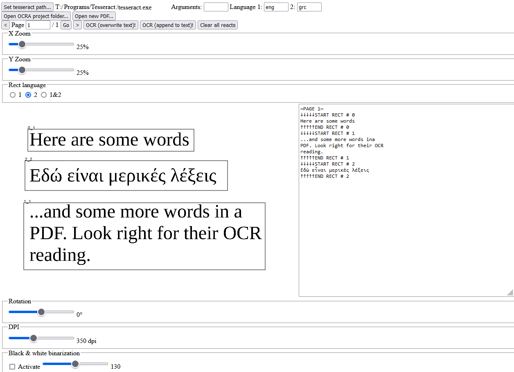

# OCRA - An OCR Assistant



## Main functions

OCRA aims to assist in performing [Tesseract](https://github.com/tesseract-ocr/tesseract)
OCRs of PDFs where an automatic selection of text areas is hard to achieve. With OCRA, one can load a PDF
and then visually mark, in each page, all areas with the text that should the OCRed. Each
marked area can be associated to one of two or both set languages. Furthermore, one can also edit the text transcripts,
and rotate, binarize, change the DPI as well as zoom in/out each page separately. All page-specific settings are stored and can be loaded
again using OCRA, and all results are also stored directly in the form of OCRA projects which contain the
edited PDF pages and the resulting Tesseract OCR transcripts as text files.

## Installation as developer

### A) Clone this repository

```sh
git clone https://github.com/Paulocracy/OCRA
```

### B) Python side

1. If not done yet, install Anaconda or Miniconda via, e.g., https://www.anaconda.com/products/individual

2. With the terminal inside OCRA's folder, create its anaconda environment:

```sh
conda env create -n ocra -f environment.yml
```

### D) Run OCRA

Now, you can run OCRA through

```sh
conda activate ocra
python run.py
```

### E) Uninstall

If you do not need OCRA anymore, you can delete the conda environment as follows:

```sh
conda env remove -n ocra
```

## Programmatic approach

### General information

OCRA is a management GUI for OCRing PDF documents with Tesseract. Programmatically, it is written in Python, HTML and "typed" JavaScript ("typed" through [JSDoc comments](https://www.typescriptlang.org/docs/handbook/jsdoc-supported-types.html)). The Python side accesses Tesseract - through [pytesseract](https://github.com/madmaze/pytesseract) -, performs all image retrieval and manipulation operations - through [Pillow](https://python-pillow.org/) -, and performs all input/output functions on the hard drive disk. Additionally, it provides a [Flask](https://github.com/pallets/flask/) server which communicates with the HTML&JavaScript side. HTML is used to describe the basic grid of OCRA's browser-based GUI. JavaScript is used to formulate and visualize all dynamic responses on the browser GUI to the user's actions. The communication between the GUI browser client and the Flask server works through the JavaScript library [Socket.IO](https://github.com/socketio/socket.io).

### Source code structure

* "static/script.js": Contains the client-side (GUI) logic of OCRA in JavaScript form. In particular, it shows the PDF page's content, visualizes the effect of the image settings, displays the drawn rectangles and shows the Tesseract config. Communicates with a running "server.py" through Socket.IO.
* "templates/index.html": Is the main descriptor of the GUI's content. I.e., it describes what is shown and in what order it is shown. This order and the IDs of the HTML elements are referenced in "script.ts".
* "ocra.py": Contains OCRA's main class which actually creates the OCRA project folders & internal files and which executes pymupdf for PDF loading, Pillow for image manipulation and pytesseract for Tesseract usage.
* "server.py": Starts OCRA's Flask server. This command should be used to *run* OCRA if you haven't changed its source code.
* "test.py": pytest test script. Currently just testing the imports. Can be run through executing "pytest" in OCRA's main folder.
* "utils.py": Small utility or helper Python functions used by "server.py" and/or "ocra.py".
